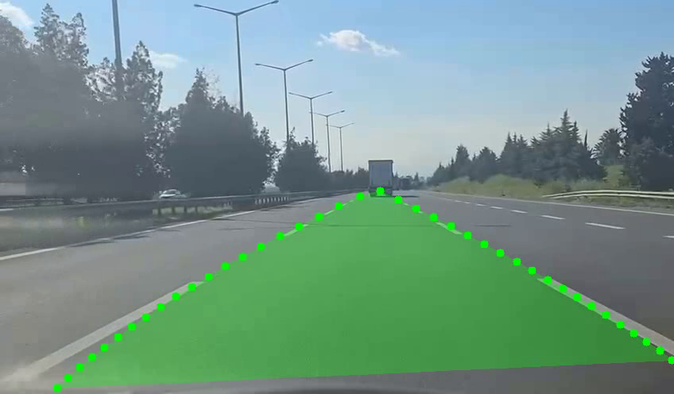

# LuminaLane AI: Lane Detection Engine



---

## 🌐 Language / Dil
- [English (#english)]
- [Türkçe (#türkçe)]

---

<a name="english"></a>
## [EN] Technical Overview

This project implements an efficient lane detection pipeline using the **Ultra-Fast-Lane-Detection (UFLD)** architecture combined with a custom stabilization layer.

### ⚙️ How it Works
1.  **Row-based Classification:** Instead of pixel-wise segmentation, the model treats lane detection as a row-selection problem. It predicts the most likely column for each predefined horizontal row anchor. This drastically reduces computational cost.
2.  **Temporal Smoothing (Custom):** To prevent flickering (especially with dashed lines), we implemented a `LaneSmoothing` engine.
    - **Exponential Moving Average (EMA):** Filters out sharp noise between frames.
    - **2nd Degree Polynomial Fitting:** Connects the predicted points with a smooth curve for better visualization and path estimation.
3.  **GUI Integration:** A desktop interface built with `CustomTkinter` manages multi-threaded processing, allowing high-resolution video inference without UI lag.

### 🚀 Setup
```bash
chmod +x setup_project.sh launch_app.sh
./setup_project.sh
./launch_app.sh
```

---

<a name="türkçe"></a>
## [TR] Teknik Detaylar

Bu proje, **Ultra-Fast-Lane-Detection (UFLD)** mimarisini temel alan ve üzerine eklenmiş özel bir stabilizasyon katmanı içeren verimli bir şerit algılama sistemidir.

### ⚙️ Nasıl Çalışır?
1.  **Satır Bazlı Sınıflandırma:** Model, şeritleri tüm pikselleri tarayarak (segmentasyon) değil, önceden tanımlanmış yatay satırlarda (row anchors) şeridin en güçlü olduğu "hücreyi" seçerek bulur. Bu, işlem maliyetini inanılmaz ölçüde düşürür.
2.  **Zamansal Yumuşatma (Özel Geliştirme):** Özellikle kesikli çizgilerde oluşan titremeleri engellemek için `LaneSmoothing` motoru geliştirilmiştir.
    - **EMA Filtresi:** Kareler arasındaki ani gürültüleri eler.
    - **2. Derece Polinom Uyumu:** Tespit edilen noktaları pürüzsüz bir parabolik eğri ile birleştirerek yol tahminini netleştirir.
3.  **GUI Entegrasyonu:** `CustomTkinter` ile hazırlanan masaüstü arayüzü, yapay zeka işlemlerini arka planda (multi-thread) yöneterek yüksek çözünürlüklü videolarda donma yapmadan çalışır.

### 🚀 Kurulum
```bash
chmod +x setup_project.sh launch_app.sh
./setup_project.sh
./launch_app.sh
```
